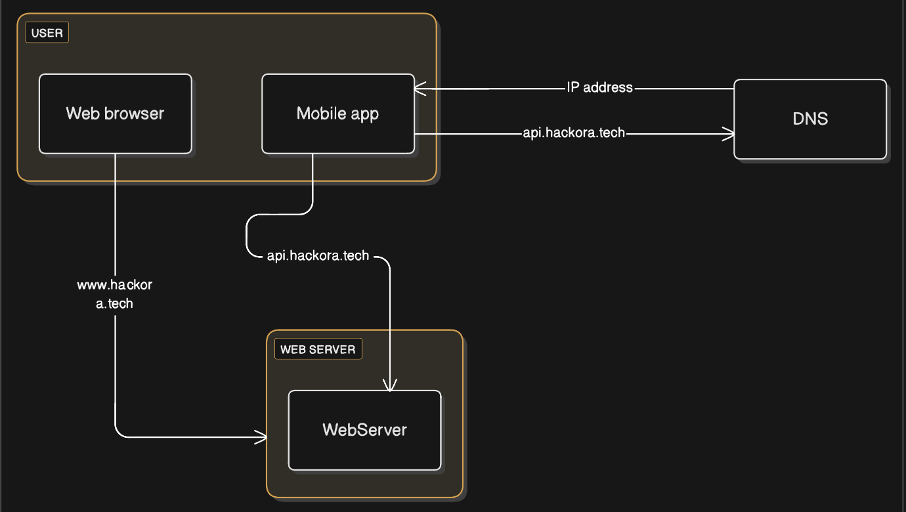

# Chapter 1: Single Server Architecture

## What You'll Learn

By the end of this chapter, you'll be able to:

- Understand how a single server architecture works from the ground up
- Follow the journey of a user request from their browser to your server and back
- See how DNS translates website names into actual server addresses
- Know when a single server is the right choice (and when it's not)
- Recognize the real trade-offs between simplicity and scalability

---

## Introduction

Let's start with the basics. Before you can build massive, distributed systems that handle millions of users, you need to understand where everything begins: the single server setup.

Think of it like this your entire application lives on one machine. Your web app, database, cache, and everything else share the same home. It's all running on a single physical or virtual server. Simple, right?

And honestly, there's nothing wrong with that. In fact, most successful applications started exactly this way. You don't need a complex architecture on day one. A single server is often the smartest choice when you're just getting started. It teaches you the fundamentals of system design, helps you understand resource management, and forces you to think about trade-offs lessons that'll serve you well when you eventually need to scale up.



**Figure 1-1** shows you the big picture everything living together on one server, with users connecting from their browsers and mobile apps, while DNS helps translate domain names into actual addresses.

---

## How Requests Actually Flow

Let's walk through what actually happens when someone visits your website or uses your app. It's pretty fascinating when you break it down.

Every time a user clicks a link or opens your app, there's a whole journey happening behind the scenes. The request travels from their device, figures out where your server lives, knocks on your server's door, and then your server sends back the right content. Let's see how this works step by step.

### The Four-Stage Journey of a Request


**Figure 1-2** illustrates the sequential flow of a typical web request, numbered from ① to ④, demonstrating the interaction between user clients, DNS infrastructure, and the web server.

#### Stage 1: Finding Your Server's Address (DNS Resolution)

Imagine trying to remember `11.222.33.444` every time you wanted to visit your favorite website. Pretty annoying, right? That's why we use friendly names like `www.hackora.tech` instead.

Here's why domain names are awesome:

- **Easy to remember**: "hackora.tech" beats a string of numbers any day
- **Flexible**: You can change servers behind the scenes without breaking everyone's bookmarks
- **Smart routing**: One domain can point to multiple servers for load balancing

DNS (Domain Name System) is like the internet's phone book it translates those friendly names into actual IP addresses that computers understand. It's a massive, distributed system that works incredibly well.

**Real-world tip**: Most companies don't run their own DNS servers. Instead, they use services like Amazon Route 53, Cloudflare, or Google Cloud DNS. Why? These providers handle the complexity, keep things fast and reliable worldwide, and protect against attacks. It's one less thing to worry about.

#### Stage 2: Getting the IP Address

Once your browser asks "where's hackora.tech?", the DNS system goes to work. It's actually a bit like asking for directions your request bounces through a few different servers:

1. **DNS Resolver**: Usually your internet provider handles this, though you can use others like Google (8.8.8.8)
2. **Root Name Servers**: These point you toward the right neighborhood
3. **TLD Name Servers**: These handle the .com, .org, .tech parts
4. **Authoritative Name Servers**: These give you the final answer

In our example, `www.hackora.tech` comes back as `11.222.33.444`. Now your browser knows exactly where to connect.

**Quick note**: To keep things fast, DNS answers get cached everywhere in your browser, your computer, your router. Each answer comes with a TTL (Time-to-Live) value that says how long it's good for. This way, you're not looking up the same address over and over again.

#### Stage 3: Making the Request

Now that your browser knows where to find the server, it's time to actually connect and ask for something. This happens over HTTP (or HTTPS for secure connections). But first, your browser and the server need to shake hands literally called a "three-way handshake":

1. **SYN**: "Hey server, I want to talk to you!"
2. **SYN-ACK**: "Cool, I'm listening. Ready when you are!"
3. **ACK**: "Awesome, let's do this!"

Once connected, your browser sends an HTTP request that includes:

- **What you want to do**: GET (fetch something), POST (send data), PUT (update something), DELETE (remove something), etc.
- **What you're asking for**: Like `/users/profile` or `/api/products`
- **Extra info in headers**: Your login token, what language you speak, what kind of data you want back
- **Sometimes, a payload**: The actual data you're sending (like a form submission)

All of this gets sent to our server at `11.222.33.444`.

#### Stage 4: Your Server Responds

Now your server gets to work. Here's what happens behind the scenes:

1. **Parse the request**: Figure out what's being asked
2. **Route it**: Send it to the right part of your application
3. **Do the work**: Run your business logic, validate things, make decisions
4. **Hit the database**: Grab or update data if needed
5. **Format the response**: Package everything up nicely

The response looks different depending on who's asking:

**For web browsers**: Your server sends back HTML (the structure), CSS (the styling), and JavaScript (the interactive bits). The browser takes all this and builds the page you see. It constructs what's called a DOM (Document Object Model), applies the styles, and runs the JavaScript to make things interactive.

**For mobile apps and APIs**: Instead of HTML, your server sends back JSON a simple, text-based format that's easy for any programming language to understand. It looks something like `{"name": "John", "age": 30}`. Clean, lightweight, and universally compatible. That's why pretty much every modern API uses JSON.

## Top Interview Questions & Answers

### 1. **"What are the main limitations of a single server architecture?"**

**Expected Answer:**

- **Availability**: No failover mechanism; downtime affects all users
- **Scalability**: Limited to vertical scaling; hitting hardware limits
- **Performance**: CPU/memory/disk shared between all services
- **Deployment Risk**: Updates require downtime or risk entire system
- **Security**: One breach compromises everything

---

### 2. **"How would you handle increased traffic in a single server setup?"**

**Expected Answer:**

- **Short-term**: Vertical scaling (upgrade CPU, RAM, SSD)
- **Optimization**:
  - Enable caching (Redis/Memcached)
  - Optimize database queries and add indexes
  - Implement CDN for static assets
  - Enable compression (Gzip)
  - Use connection pooling
- **Long-term**: Migrate to distributed architecture

---

### 3. **"Why do both www.hackora.tech and apimysitecom point to the same server?"**

**Expected Answer:**

- **Cost Efficiency**: Small applications don't need separate servers
- **Simplicity**: Easier to manage one server initially
- **Logical Separation**: Different domains provide:
  - Clear API boundaries
  - Different routing rules
  - Separate SSL certificates possible
  - CORS configuration
- **Virtual Hosts**: Web server (Nginx/Apache) routes based on domain

---

### 4. **"What's the difference between vertical and horizontal scaling? Which applies here?"**

**Expected Answer:**

- **Vertical Scaling (Scale Up)**:
  - Add more CPU, RAM, disk to existing server
  - Applicable to single server setup
  - Has hard limits (maximum hardware capacity)
  - Requires downtime for upgrades
- **Horizontal Scaling (Scale Out)**:
  - Add more servers/instances
  - Not possible in single server setup
  - Nearly unlimited scaling
  - Requires load balancer and distributed architecture

---

### 5. **"How would you ensure high availability in this architecture?"**

**Expected Answer:**

- **You can't truly** achieve high availability with single server, but you can:
  - **Automated Backups**: Regular snapshots to restore quickly
  - **Monitoring & Alerts**: Uptime monitoring (Pingdom, DataDog)
  - **Process Monitoring**: Use PM2, Supervisor to auto-restart crashed processes
  - **Health Checks**: Implement endpoint monitoring
  - **Disaster Recovery Plan**: Document recovery procedures
- **Real HA Solution**: Need multi-server architecture with load balancing

---

### 6. **"What metrics would you monitor in a single server setup?"**

**Expected Answer:**

- **System Metrics**:
  - CPU utilization (should be < 70%)
  - Memory usage (watch for memory leaks)
  - Disk I/O and space
  - Network bandwidth
- **Application Metrics**:
  - Response time / latency
  - Error rates (4xx, 5xx)
  - Request per second (RPS)
  - Database query performance
- **Tools**: CloudWatch, Prometheus, Grafana, New Relic

---

### 7. **"How does DNS resolution work in this architecture?"**

**Expected Answer:**

1. User types `api.mysite.com` in browser/app
2. Device checks local DNS cache
3. If not cached, queries recursive DNS resolver (ISP)
4. Resolver queries root DNS → TLD DNS (.com) → Authoritative DNS
5. Authoritative DNS returns A record: `15.125.23.214`
6. IP cached at multiple levels (browser, OS, ISP)
7. User connects directly to that IP

**TTL Impact**: Time-To-Live determines how long IP is cached

---

### 8. **"What happens when you deploy new code to this server?"**

**Expected Answer:**

**Without Zero-Downtime:**

1. SSH into server
2. Stop application
3. Pull new code from Git
4. Install dependencies
5. Run migrations
6. Start application
7. **Result**: 30 seconds to 5 minutes downtime

**Better Approach:**

- Use process managers (PM2) with `reload` instead of `restart`
- Blue-green deployment simulation
- Database migrations before code deployment
- Health checks before switching traffic

---

### 9. **"Company: 'We're experiencing slow API responses. How would you debug?'"**

**Step-by-Step Answer:**

1. **Check System Resources**:

   ```bash
   top, htop      # CPU/Memory
   iostat         # Disk I/O
   netstat        # Network connections
   ```

2. **Application Logs**:

   - Check error logs
   - Look for timeouts, exceptions

3. **Database**:

   - Slow query log analysis
   - Missing indexes
   - Connection pool exhaustion

4. **Network**:

   - Check latency: `ping, traceroute`
   - DNS resolution time

5. **Application Code**:
   - Profile code (New Relic APM)
   - N+1 query problems
   - Inefficient algorithms

---

### 10. **"How would you migrate from single server to multi-server architecture?"**

**Migration Strategy:**

1. **Separate Database First**:

   - Move DB to managed service (RDS)
   - Update connection strings
   - Test thoroughly

2. **Add Load Balancer**:

   - Deploy ALB/NLB
   - Keep single app server initially
   - Update DNS to point to LB

3. **Horizontal Scaling**:

   - Create application server AMI
   - Launch additional instances
   - Configure auto-scaling

4. **Separate Static Assets**:

   - Move to S3 + CloudFront CDN

5. **Add Caching Layer**:

   - Deploy Redis/ElastiCache

6. **Final Architecture**:
   - LB → Multiple App Servers → DB + Cache

---

### 11. **"What security concerns exist in single server setup?"**

**Answer:**

- **Single Attack Surface**: All services exposed on one machine
- **Lateral Movement**: If attacker gets in, they access everything
- **No Network Segmentation**: Can't isolate database from public internet
- **Mitigation**:
  - Firewall rules (only ports 80/443 open)
  - Regular security updates
  - Principle of least privilege
  - Web Application Firewall (WAF)
  - Fail2ban for brute force protection
  - SSL/TLS certificates

---

### 12. **"Estimate the maximum users this setup can handle"**

**Calculation Approach:**

```
Assumptions:
- Server: 4 vCPU, 16GB RAM
- Each request: 50ms processing time
- Concurrent connections: 1000

Theoretical Max RPS = (1000 concurrent) / (0.05s) = 20,000 RPS

Realistic Max (70% capacity): ~14,000 RPS

If each user makes 10 requests/minute:
Max Users = 14,000 RPS * 60s / 10 = ~84,000 users/minute
```

**Variables Affecting Capacity:**

- Database query complexity
- Payload size
- CPU-intensive operations
- Memory per request

---

### 13. **"Real Scenario: Server CPU hits 100% at 3 AM. What do you do?"**

**Immediate Actions:**

1. **Identify Process**: `top` or `htop` to find culprit
2. **Check Logs**: Look for errors, unusual patterns
3. **Restart if Needed**: If it's a runaway process
4. **Scale Vertically**: Temporarily upgrade instance if possible

**Investigation:**

- Was it a cron job? (backups, batch processing)
- DDoS attack? (check access logs)
- Memory leak causing swap usage?
- Sudden traffic spike?

**Prevention:**

- Schedule heavy jobs during off-peak hours
- Rate limiting
- Resource alerts before reaching 100%
- Consider offloading batch jobs to separate worker

---

### 14. **"How do you handle database backups in single server?"**

**Answer:**

- **Automated Daily Backups**:

  - Cron job for mysqldump/pg_dump
  - Store on S3 with versioning
  - Retention policy (daily: 7 days, weekly: 4 weeks, monthly: 12 months)

- **Snapshot-based**:

  - EBS snapshots if on AWS
  - Faster recovery

- **Testing**:

  - Regularly test restoration process
  - Verify backup integrity

- **Downside of Single Server**:
  - Backups compete for resources
  - Point-in-time recovery limited

---

### 15. **"Companies like Amazon/Netflix ask: When would you NOT use a single server?"**

**Don't Use Single Server When:**

- **High Availability Required**: Financial apps, healthcare
- **Expected High Traffic**: Viral potential, marketing campaigns
- **Geographic Distribution**: Users across continents (need regional servers)
- **Regulatory Compliance**: Data sovereignty requirements
- **Sensitive Data**: Need network segmentation
- **24/7 Operations**: Can't afford downtime for maintenance

**When Single Server is OK:**

- Internal tools with <100 users
- MVP/Prototype validation
- Development environments
- Personal projects
- Budget constrained startups

---

## Real Company Interview Scenarios

### **Amazon/AWS:**

_"Design a system that starts with single server but can scale to millions of users"_

**Answer**: Start with single EC2, then:

- Phase 1: Move DB to RDS
- Phase 2: Add ALB + Auto Scaling
- Phase 3: CloudFront CDN
- Phase 4: ElastiCache
- Phase 5: Multi-region deployment

---

### **Google:**

_"Calculate the cost difference between single server vs distributed for 10K daily users"_

**Single Server**:

- t3.xlarge: $0.1664/hr × 720hr = ~$120/month

**Distributed**:

- ALB: $20/month
- 2× t3.medium: $60/month
- RDS: $80/month
- Total: ~$160/month

**Difference**: $40/month = 33% increase for redundancy

---

This comprehensive guide covers the theoretical knowledge and practical scenarios companies typically ask about single server architectures!
